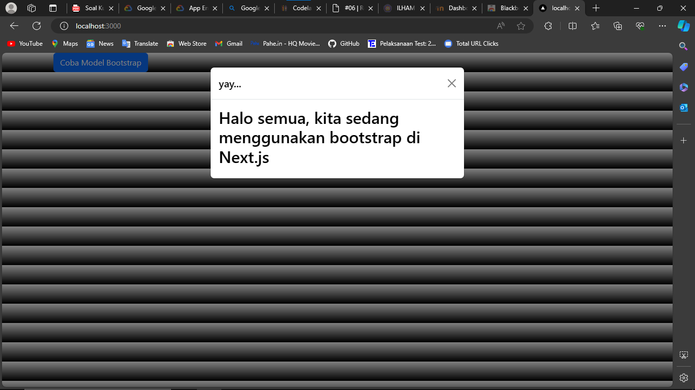
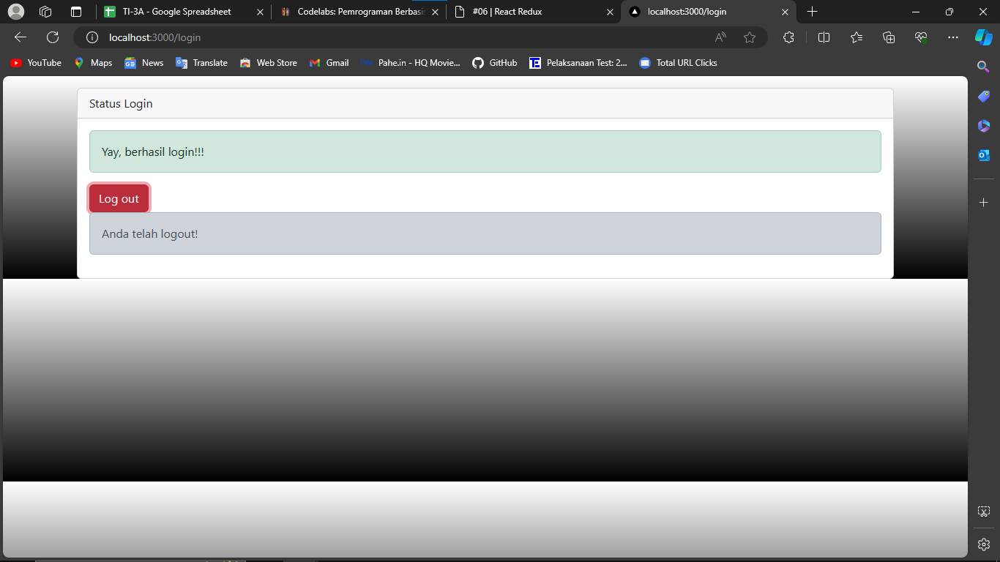
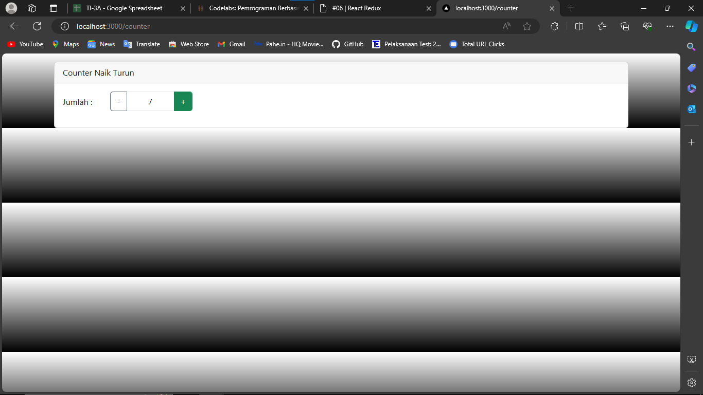

This is a [Next.js](https://nextjs.org/) project bootstrapped with [`create-next-app`](https://github.com/vercel/next.js/tree/canary/packages/create-next-app).

## Getting Started

First, run the development server:

```bash
npm run dev
# or
yarn dev
# or
pnpm dev
# or
bun dev
```

Open [http://localhost:3000](http://localhost:3000) with your browser to see the result.

You can start editing the page by modifying `pages/index.tsx`. The page auto-updates as you edit the file.

[API routes](https://nextjs.org/docs/api-routes/introduction) can be accessed on [http://localhost:3000/api/hello](http://localhost:3000/api/hello). This endpoint can be edited in `pages/api/hello.ts`.

The `pages/api` directory is mapped to `/api/*`. Files in this directory are treated as [API routes](https://nextjs.org/docs/api-routes/introduction) instead of React pages.

This project uses [`next/font`](https://nextjs.org/docs/basic-features/font-optimization) to automatically optimize and load Inter, a custom Google Font.

## Learn More

To learn more about Next.js, take a look at the following resources:

- [Next.js Documentation](https://nextjs.org/docs) - learn about Next.js features and API.
- [Learn Next.js](https://nextjs.org/learn) - an interactive Next.js tutorial.

You can check out [the Next.js GitHub repository](https://github.com/vercel/next.js/) - your feedback and contributions are welcome!

## Deploy on Vercel

The easiest way to deploy your Next.js app is to use the [Vercel Platform](https://vercel.com/new?utm_medium=default-template&filter=next.js&utm_source=create-next-app&utm_campaign=create-next-app-readme) from the creators of Next.js.

Check out our [Next.js deployment documentation](https://nextjs.org/docs/deployment) for more details.

## Laporan Praktikum

|  | Pemrograman Berbasis Framework 2024 |
|--|--|
| NIM |  2141720230 |
| Nama |  Ilham Khalis Putra Agatha |
| Kelas | TI - 3A |

### Praktikum 1



### Praktikum 2



### Praktikum 3



### Pertanyaan Praktikum

1. Apa kegunaan dari kode ini import { useEffect } from "react"; Pada file pages/_app.tsx? jelaskan

Digunakan untuk mengimpor fungsi useEffect dari library React.

2. Jika pada file pages/_app.tsx kita tidak menggunakan useEffect menghapus baris 3, dan baris 9-11, apa yang akan terjadi?

Maka semua operasi yang seharusnya dilakukan setelah render pertama tidak akan dijalankan.

3. Mengapa di react/nextjs penulisan tag html untuk class, harus diganti menjadi className ?

Karena class adalah kata kunci yang dicadangkan dalam JavaScript, dan JSX lebih dekat ke JavaScript daripada HTML.

4. Apakah store pada nextjs bisa menyimpan banyak redux reducer?

Ya, store pada Next.js bisa menyimpan banyak reducer Redux.

5. Jelaskan kegunaan dari file store.js!

File store.js biasanya digunakan untuk mengatur store Redux.

6. Pada file pages/login.tsx, apa maksud dari kode ini ?
const { isLogin } = useSelector((state) => state.auth);

Digunakan untuk mengambil nilai isLogin dari state Redux.

7. Pada file pages/counter.tsx, apa maksud dari kode ini?
const {totalCounter} = useSelector((state) => state.counter);

Membaca data dari store Redux.